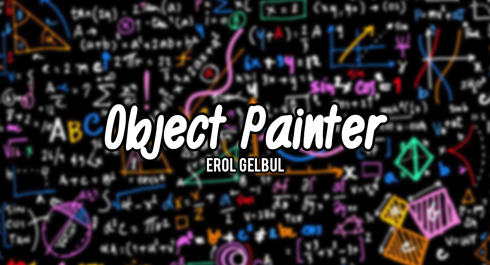
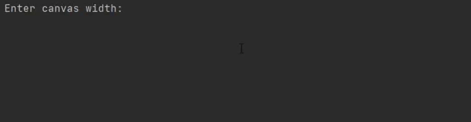
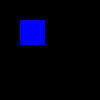

<!-- ABOUT THE PROJECT -->
## About

This is another OOP project I worked on, and the time period of this project was my pre-entry to
computer vision. I wanted to get familiar with NumPy. I also used Python's imaging library: Pillow.

I created a basic CLI for the user to interact with the app. The user creates a canvas with dimensions up to them to decide.
The way I approached this was to have a canvas created by numpy arrays, forming a matrix. You can easily do this with numpy.zeros:
`data = np.zeros((10, 10, 3), dtype=np.uint8)`. The dimensions in this case would be 10x10 and 3 will represent the RGB colors. 
In `array_to_numpy.py` file I made a quick demo on how to tackle this task.

The next task was to figure how I can display new objects on the canvas. I created a Canvas class, that would hold the canvas data
and render it in an object instance. First, I ask the user to input values for the object they want to create then create an object
instance depending on the object they picked, either rectangle or square. Since I have the canvas object already saved up from before,
I can apply this new object instance onto the canvas object instance by using the draw method in `shapes.py`.

Ultimately, the object is outputted using the make method of `canvas.py`.

  

(<a href="#top">back to top</a>)

<!-- TECH -->
## Technologies

Libraries: [NumPy](https://numpy.org/), [Pillow](https://pillow.readthedocs.io/en/stable/)

(<a href="#top">back to top</a>)

<!-- CONTRIBUTING -->
## Contributing

If you would like to add any extra features to the optimisation simulation, feel free to fork and create a pull request. Thank you!

1. Fork the Project
2. Create your Feature Branch (`git checkout -b feature/AmazingFeature`)
3. Commit your Changes (`git commit -m 'Add some AmazingFeature'`)
4. Push to the Branch (`git push origin feature/AmazingFeature`)
5. Open a Pull Request

(<a href="#top">back to top</a>)

<!-- CONTACT -->
## Contact

Erol Gelbul - [Website](http://www.erolgelbul.com) - erolgelbul@gmail.com

Project Link: [Object Painter](https://github.com/ErolGelbul/object_painter)

(<a href="#top">back to top</a>)

